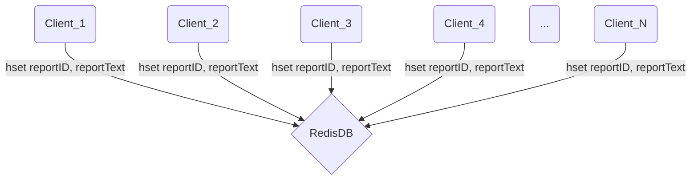

# Nesco - CrashReporter
[](https://openupm.com/packages/com.nesco.crashreporter/)  

This tool is employed to swiftly detect errors occurring within Unity projects and to save detailed reports of these
errors to a remote database. It facilitates the quick collection of errors when testing your game on
independent devices or when releasing a demo, ensuring a prompt and efficient error-gathering
process.

### HOW DOES IT WORK
CrashReporter automatically comes into play when an unhandled error occurs in your
application. It swiftly gathers the details of the error, generates a comprehensive report, and, within
milliseconds of the error's occurrence, transmits this information to a database via a specified REST
URL, providing developers with immediate access to the incident.

### Install via package manager

Please follow the instrustions:
* open **Edit/Project Settings/Package Manager**
* add a new Scoped Registry (or edit the existing OpenUPM entry)
```
NAME => package.openupm.com
URL => https://package.openupm.com
SCOPE(S) => com.nesco.crashreporter
```
* click **Save** or **Apply**
* open **Window/Package Manager**
* select Add package by name... or Add package from git URL...
* paste **com.nesco.crashreporter** into name or __https://github.com/nskrkmz/CrashReporter.git__ into git URL
* paste **1.1.0-beta** into version
* click **Add**
  
#### Alternatively, merge the snippet to Packages/manifest.json
```json
{
    "scopedRegistries": [
        {
            "name": "package.openupm.com",
            "url": "https://package.openupm.com",
            "scopes": [
                "com.nesco.crashreporter"
            ]
        }
    ],
    "dependencies": {
        "com.nesco.crashreporter": "1.1.0-beta"
    }
}

```
#### Install via command-line interface
```shell
$ openupm add com.nesco.crashreporter
```


### SETUP
To be able to use Nesco - CrashReporter in Unity, you don't need to install an external package.
However, since it writes crash reports to a remote database, the setup is a two-side process.
1. Unity Editor Side:
    * Click on the "Tools/Nesco/Create CrashReporter" tab from the main menu above
      
    > This process creates the necessary object and adds the required components.

    * Navigate to Assets/Nesco/CrashReporter/DBCore in the Project tab, and find the DBConfiguration scriptable object instances of MainDB and TestDB.
    
    > If you can't find them or want to create your own, go to the desired path, right-click, select Create/Nesco/CrashReporter/New DBConfiguration to create a new instance.

    * Drag the DBConfiguration instance you created for testing into the TestDB field of the DBManager component inside the CrashReporter object in your scene. Repeat the same process for your Main DB configuration.
    
    > If you don't have a CrashReporter object in your scene, follow step 1.1

2. Database Side:
    * Visit upstash.com and register using one of the various sign-up options provided.
    
    > Refer to the Why Use Upstash/Redis Section to understand why Upstash Redis is used in the project.

    * Create a database for yourself.

    * Assign the REST_URL and REST_TOKEN values from the Details section of your database to the corresponding fields in the DBConfiguration instances you previously created in order to access your database from Unity. 


### WHY DID I USE UPSTASH / REDIS

* Developer-friendly: For your applications in the testing and development stages, they offer a generously sufficient free tier plan, and if you wish to upgrade your database, there is a guaranteed fixed pricing limit (https://upstash.com/pricing)
* Easy access, use and setup
* Fast communication with Database
* Unlike other Redis databases, it provides durable storage capability. (https://upstash.com/docs/redis/features/durability)
    
### DEFAULT CRASH REPORT INCLUDES

* PlayerID
* Message
* LogType
* StackTrace
* SceneIndex
* Timestamp
* RuntimePlatform
* DeviceModel
* OS
* OperatingSystemFamily
* DeviceName
* DeviceType
* GraphicsDeviceName
* GraphicsDeviceType
* GraphicsDeviceVersion
* GraphicsMemorySize
* ProcessorType
* SystemMemorySize
* ProcessorCount
* ProcessorFrequency
* SupportsGyroscope
* SupportsInstancing
* SupportsLocationService
* SupportsRayTracing
* SupportsVibration

### SEND CUSTOM REPORTS

* Completely independent of reportable unhandled log occurrences, you can send a report from any part of your code using one of the following options.

```csharp
// Create referance
[SerializeField] private CrashReportManager _reportManager;

private void Foo()
{
    .
    .
    .
    _reportManager.SendCustomReport("EasterEggs", EasterEgg.ID, playerID)
}

```

```csharp
// Create referance
[SerializeField] private CrashReportManager _reportManager;

Action<UnityWebRequest.Result> RequestCallback = (result) =>
{
    if(result != UnityWebRequest.Result.Success)
    {
        if(CheckInternetConnection())
        {
            UIManager.instance.PushPopUp(PopUpType.Request, "Please activate your internet connection.");
        }
        .
        .
        .
    }
    .
    .
    .
            
};

private void Foo()
{
    .
    .
    .
    _reportManager.SendCustomReport("EasterEggs", EasterEgg.ID, playerID, RequestCallback)
}

```

